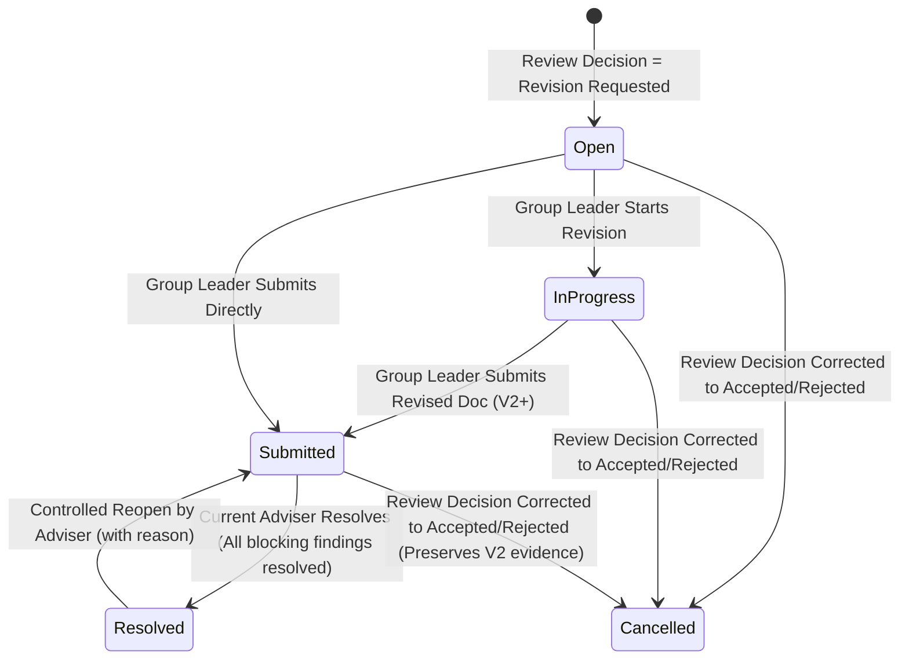

# Phase 17 — Revision Tracker Architecture & Technical Documentation

## 1. Overview
Phase 17 implements the **Revision Tracker** module for NDMU-RMAS, modernizing revision lifecycle management away from individual user assignments (`assigned_to`) toward group-owned revision cycles (`ResearchClassGroup`).

Revision cycles are automatically created when an adviser issues a `revision_requested` decision on a document review. Cycles enforce group leader submission authority, adviser decision reconciliation, blocking findings resolution, and controlled reopening.

---

## 2. Key Architectural Components

### Database Schema Modernization
- **Migration**: `database/migrations/2026_08_11_000001_modernize_revision_requests_schema.php`
- `research_class_group_id`: `restrictOnDelete()` — Ensures historical revision evidence remains intact even if a research group is disbanded.
- `source_document_review_id`: `nullOnDelete()`, `UNIQUE` — Database-level 1-to-1 idempotency per effective review decision.
- `submitted_document_id`: `nullOnDelete()` — Links the revised response document submitted by the student group.
- Invalidation attributes: `invalidated_at`, `invalidated_reason`.

### Data Models & Enums
- **Model**: `App\Models\RevisionRequest`
  - Fillables: `research_class_group_id`, `document_id`, `source_document_review_id`, `submitted_document_id`, `requested_by`, `assigned_to`, `source_type`, `title`, `instructions`, `status`, `due_at`, `resolved_at`, `invalidated_at`, `invalidated_reason`.
  - Relationships: `researchClassGroup`, `sourceDocument`, `sourceReview`, `submittedDocument`, `requester`, `events`.
- **Enum**: `App\Enums\RevisionStatus`
  - Statuses: `Open`, `InProgress`, `Submitted`, `Resolved`, `Cancelled`.

---

## 3. Workflow & State Transitions



### State Machine Rules
1. **Automatic Creation**: Issued inside `ReviewDocument` transaction when decision is `RevisionRequested`.
2. **Start Revision (`Open -> InProgress`)**: Executed by active Group Leader via `StartRevisionCycle`.
3. **Submit Response (`InProgress -> Submitted`)**: Executed by active Group Leader via `SubmitRevisionDocument`. Derives stage from source document, increments version, marks `is_current = true`, and populates `submitted_document_id`.
4. **Adviser Resolution (`Submitted -> Resolved`)**: Executed by Current Assigned Adviser via `ResolveRevisionCycle`. Requires all blocking findings (`severity` in `['revision', 'critical']`) on source document to be resolved (`resolved_at !== null`).
5. **Controlled Reopening (`Resolved -> Submitted`)**: Executed by Current Assigned Adviser via `ReopenRevisionCycle`. Reverts accidental resolution back to `Submitted` state, requires non-empty reason string, and preserves `submitted_document_id`.
6. **Decision Correction Reconciliation**:
   - `Revision Requested -> Accepted/Rejected`: Invalidates cycle (`status = Cancelled`). If response document exists, preserves document link and logs audit event.
   - `Accepted/Rejected -> Revision Requested`: Creates 1 new cycle.

---

## 4. Authorization & Policies

- **Policy**: `App\Policies\RevisionRequestPolicy`
- **View (`view`)**: Active/historical members of the research group, current/original adviser, or class facilitator.
- **Start (`start`)**: Active Group Leader (`$group->isLeader($user)`) AND group active AND cycle status `Open`.
- **Submit (`submit`)**: Active Group Leader (`$group->isLeader($user)`) AND group active AND cycle status in `[Open, InProgress]` AND `submitted_document_id === null`.
- **Resolve (`resolve`)**: User has `revisions.resolve` permission AND current assigned adviser (`$group->adviser_id === $user->id`) AND group active AND cycle status `Submitted`.
- **Update Due Date (`updateDueDate`)**: Current Assigned Adviser (`$group->adviser_id === $user->id`).
- **Reopen (`reopen`)**: Current Assigned Adviser (`$group->adviser_id === $user->id`) AND cycle status `Resolved`.
- **Facilitator View (`facilitatorView`)**: Read-only monitoring for class facilitators (`facilitator_id === $user->id`).

---

## 5. Domain Actions & Controllers

| Action Class | Path | Description |
|---|---|---|
| `CreateRevisionCycleFromReview` | `app/Modules/Revisions/Actions/CreateRevisionCycleFromReview.php` | Creates 1-to-1 idempotent cycle from Phase 15 review decision |
| `StartRevisionCycle` | `app/Modules/Revisions/Actions/StartRevisionCycle.php` | Transitions cycle from `Open` to `InProgress` |
| `SubmitRevisionDocument` | `app/Modules/Revisions/Actions/SubmitRevisionDocument.php` | Submits corrected V2 document and links `submitted_document_id` |
| `ResolveRevisionCycle` | `app/Modules/Revisions/Actions/ResolveRevisionCycle.php` | Verifies blocking findings and resolves cycle |
| `UpdateRevisionDueDate` | `app/Modules/Revisions/Actions/UpdateRevisionDueDate.php` | Adviser due date management with audit log |
| `ReopenRevisionCycle` | `app/Modules/Revisions/Actions/ReopenRevisionCycle.php` | Controlled reopening returning cycle to `Submitted` |

| Controller Class | Path | Endpoints |
|---|---|---|
| `Student\RevisionRequestController` | `app/Http/Controllers/Student/RevisionRequestController.php` | `PATCH /student/revisions/{id}/start`<br>`POST /student/revisions/{id}/documents` |
| `Adviser\RevisionRequestController` | `app/Http/Controllers/Adviser/RevisionRequestController.php` | `PATCH /adviser/revisions/{id}/resolve`<br>`PATCH /adviser/revisions/{id}/due-date`<br>`PATCH /adviser/revisions/{id}/reopen` |

---

## 6. Verification & Test Suite

Automated tests in `tests/Feature/Revisions/RevisionWorkflowTest.php`:
1. `test_automatic_revision_cycle_creation_on_review`
2. `test_review_decision_correction_reconciliation_matrix`
3. `test_group_leader_start_and_submit_workflow`
4. `test_group_leader_can_start_and_submit_revision`
5. `test_blocking_findings_prevent_adviser_resolution`
6. `test_adviser_can_resolve_after_resolving_blocking_findings`
7. `test_controlled_reopen_returns_cycle_to_submitted_state`
8. `test_due_date_management_by_current_adviser`

Run command:
```bash
php artisan test tests/Feature/Revisions/RevisionWorkflowTest.php
```
Result: **8 passed (28 assertions)**.
